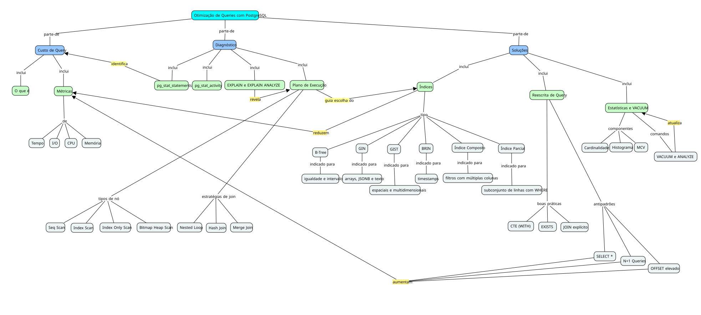

# Otimização de Queries com PostgreSQL

> Objeto de Aprendizagem desenvolvido segundo a abordagem **IMA–CID** para a matéria OPT016 - Objetos De Aprendizagem da UTFPR-CM

Aluno: Alexandre Borges Baccarini Júnior
RA: 2515520
Grupo: J

---

## Público-alvo
 
É direcionado a estudantes e desenvolvedores de software que já possuem conhecimento básico de SQL e desejam evoluir para um nível intermediário/avançado, focando em otimização de consultas no PostgreSQL.
 
| Perfil | Descrição |
|---|---|
| **Formação** | Ciência da Computação, Sistemas de Informação, Engenharia de Software ou áreas relacionadas |
| **Experiência prévia** | Conhecimento básico de SQL (SELECT, WHERE, JOIN, GROUP BY) |
| **Contexto** | Estudantes, profissionais de TI e DBAs em início de carreira |
| **Formato do curso** | Short-course (4 horas) |
 
---
 
## Requisitos de Aprendizagem

Ao concluir este Objeto de Aprendizagem, o estudante será capaz de:

### Diagnóstico e Análise
- [ ] Interpretar a saída do comando `EXPLAIN` e `EXPLAIN ANALYZE`
- [ ] Utilizar `pg_stat_statements` para identificar queries de alto custo
- [ ] Monitorar queries em execução com `pg_stat_activity`
- [ ] Compreender as métricas de custo: tempo, I/O, CPU e memória

### Plano de Execução
- [ ] Identificar os principais nós de um plano de execução (Seq Scan, Index Scan, Hash Join etc.)
- [ ] Diferenciar as estratégias de join (Nested Loop, Hash Join, Merge Join) e suas condições de uso
- [ ] Compreender como o PostgreSQL estima o custo de uma query
- [ ] Entender o impacto do paralelismo no plano de execução

### Índices
- [ ] Diferenciar os tipos de índice do PostgreSQL (B-Tree, GIN, GiST, BRIN, Parcial, Composto, de Expressão)
- [ ] Escolher o tipo de índice adequado para cada situação
- [ ] Aplicar o conceito de índice cobridor (Index Only Scan)

### Reescrita de Query
- [ ] Reconhecer antipadrões SQL (SELECT *, OFFSET elevado, N+1, função em coluna do WHERE)
- [ ] Reescrever queries utilizando CTEs, EXISTS e JOINs explícitos de forma eficiente

### Estatísticas e VACUUM
- [ ] Compreender o papel das estatísticas do planejador (cardinalidade, histograma, MCV)
- [ ] Executar e interpretar `VACUUM` e `ANALYZE`

---
 
## Mapa Conceitual
 
[link para o cmap](https://cmapscloud.ihmc.us:443/rid=22NNTYP6G-2D051KY-MF48YZ)

---
 
## Estrutura
 
É organizado em 4 módulos com duração total de 2,5 a 3 horas, seguindo uma especificação aberta do IMA–CID (pode navegar pelos módulos na ordem que preferir).
 
### Módulo 1 — Entendendo o Problema ~30 min
**Formato:** slides interativos + vídeo curto
 
| Conteúdo | Tipo |
|---|---|
| O que é custo de query e por que isso importa | Conceito + Princípio |
| Demo: uma query lenta no PostgreSQL real | Exemplo |
| Quiz: "você saberia identificar esse problema?" | Avaliação Diagnóstica |
 
---
 
### Módulo 2 — Diagnóstico ~40 min
**Formato:** slides + atividade
 
| Conteúdo | Tipo |
|---|---|
| EXPLAIN e EXPLAIN ANALYZE na prática | Conceito + Procedimento |
| Como ler um plano de execução | Conceito + Exemplo |
| Atividade: diagnosticar uma query com EXPLAIN | Exercício Exploratório |
 
---
 
### Módulo 3 — As Soluções ~60 min
**Formato:** slides + exercício prático
 
| Conteúdo | Tipo |
|---|---|
| Índices: quando usar cada tipo (B-Tree, GIN, BRIN...) | Conceito + Princípio |
| Reescrita de query: antipadrões e como corrigi-los | Procedimento + Exemplo |
| Estatísticas e VACUUM: por que o planejador erra | Conceito + Princípio |
| Atividade: otimizar uma query real e comparar antes/depois | Exercício Exploratório |
 
---
 
### Avaliação Final ~20 min
**Formato:** quiz + desafio prático
 
| Conteúdo | Tipo |
|---|---|
| 5 queries problemáticas para diagnosticar e corrigir | Avaliação Somativa |
| Feedback automático com explicação de cada resposta | Elemento Explanatório |
